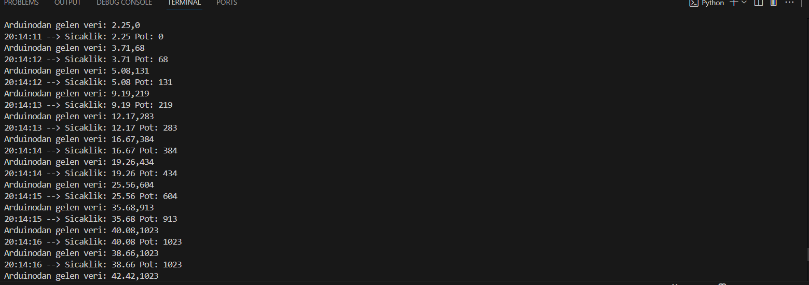
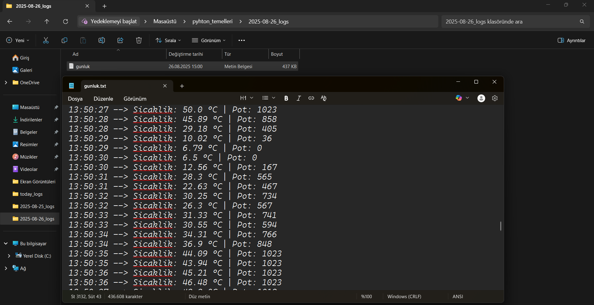

#Arduino - Python Entegrasyonu (OS Modülü Çalışması) 

##Projenin Amacı

Arduino ile Python arasında veri alışverişi yapmayı öğrenmek ve alınan verileri Python üzerinden dosya/klasör yönetimi ile günlük kayıt altına almak idi.Bu sayede sensör verilerini gerçek zamanlı okuyabildim ve **Os**,**datetime**,**time**,**pyserial** kütüphanelerini kullanarak pekiştirdim.
##Kullanılan Teknolojiler

- **Python Kütüphaneleri:** os, datetime, time, pyserial  
- **Donanımlar:** Arduino Uno, Breadboard, LED, LM35 sıcaklık sensörü, Potansiyometre, 220Ω direnç, jumper kablolar .
##Yapım Aşaması

-LED’in uzun bacağını (anot) kısmını 220 ohm direnç üzerinden Arduino’nun 9 numaralı pinine bağladım
-LED'in kısa bacağını (katot) breadboard’un eksi hattına bağladım.
-LM35 sıcaklık sensörünü LED’in sıcaklığını algılayabilmesi için LED’in yanına yerleştirdim.
  -  Sol bacak -> 5V
  -  Orta bacak ->A0
  -  Sağ bacak -> GND
- Potansiyometre bağlantıları:
  - Sol bacak -> 5V
  - Orta bacak -> A1
  - Sağ bacak -> GND
-Breadboard’un artı hattını Arduino’nun **5V** pinine, eksi hattını ise **GND** pinine jumper kablolar ile bağladım.
##Uygulama Aşaması

- Arduino’dan sıcaklık ve potansiyometre verileri **serial port** üzerinden bilgisayara gönderildi.  
- Python tarafında bu veriler okundu ve işlenerek kaydedildi.  
- Her gün için `YYYY-MM-DD_logs` formatında klasör oluşturuldu.  
- Bu klasörlerin içine açılan **gunluk.txt** dosyasına zaman damgası ile birlikte sıcaklık ve potansiyometre değerleri kaydedildi.
#Örnek Kayıt

##Terminal Çıktısı

-Aşağıda program çalıştırıldığında alınan terminal çıktısı ekran görüntüsü yer almaktadır:

##Günlük Kaydı 
-Aşağıda program çalıştırıldığında alınan günlük kaydı ekran görüntüsü yer almaktadır:

