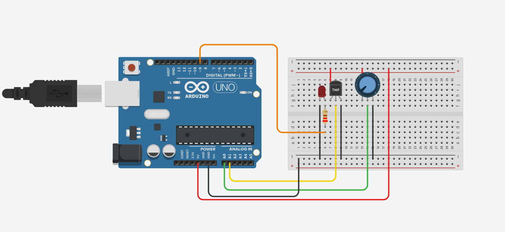

# Arduino - Python Integration (OS Module Project)
## Project Purpose

- The aim of this project was to learn how to establish data communication between Arduino and Python, and to store the received data in daily logs using Python's file/folder management.
- This allowed me to read sensor data in real time and reinforce my knowledge by using the os, datetime, time, and pyserial libraries.

## Technologies Used
- Python Libraries: os, datetime, time, pyserial
- Hardware: Arduino Uno, Breadboard, LED, LM35 temperature sensor, Potentiometer, 220Ω resistor, jumper wires

## Assembly Stage

- Connected the long leg (anode) of the LED through a 220 ohm resistor to pin 9 of the Arduino.
- Connected the short leg (cathode) of the LED to the ground rail of the breadboard.
-Placed the LM35 temperature sensor next to the LED to measure its heat.

  - Left leg -> 5V
  - Middle leg -> A0
  - Right leg -> GND
  
- Potentiometer connections:
  - Left leg -> 5V
  - Middle leg -> A1
  - Right leg -> GND

- Connected the breadboard’s positive rail to Arduino’s 5V pin and the negative rail to GND using jumper wires.
## Implementation Stage
- Temperature and potentiometer values were sent from Arduino to the computer via the serial port.
- On the Python side, the data was read and logged.
- For each day, a folder was created in the format YYYY-MM-DD_logs.
-Inside these folders, a gunluk.txt file was created, where the temperature and potentiometer values were stored with a timestamp.

# Example Records
## Terminal Output
Below is a screenshot of the terminal output when the program was executed: 

## Daily Log
Below is a screenshot of the generated daily log file:

## Circuit Diagram 

